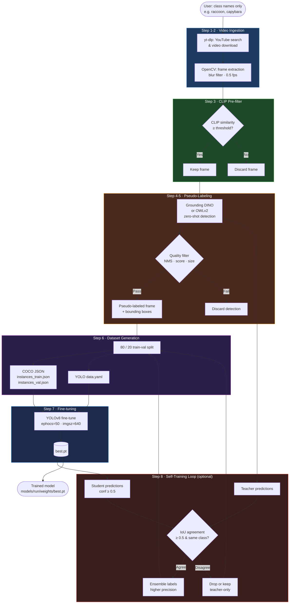
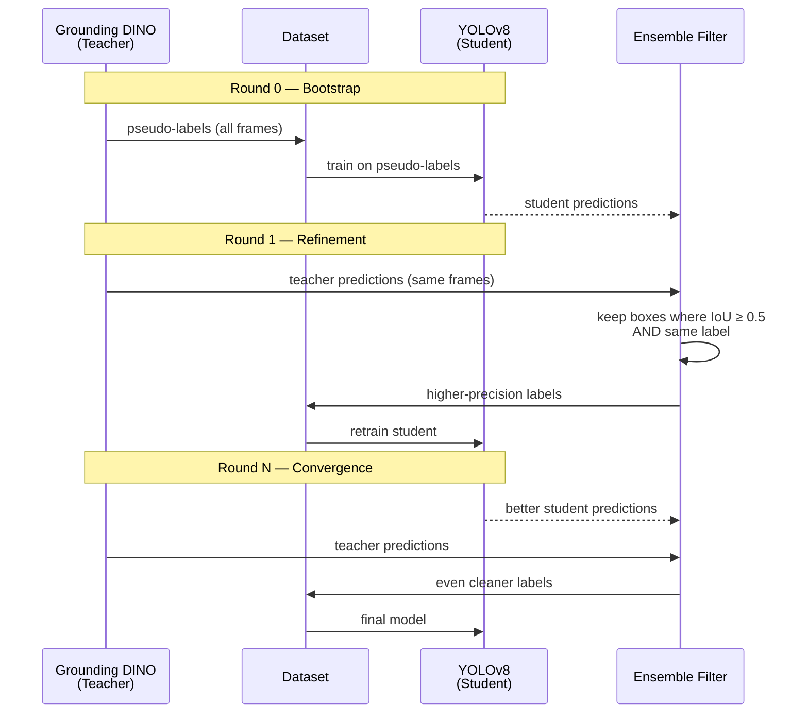

# Auto-Label Object Detection Fine-Tuning Pipeline

Fine-tune an object detection model for **new classes you define in plain text** — no manual bounding-box annotations required.

The system searches YouTube for relevant videos, extracts frames, uses open-vocabulary Vision-Language Models to generate pseudo-labels, and fine-tunes YOLOv8. An optional self-training loop iteratively improves label quality using a teacher-student ensemble.

---

## Table of Contents

1. [How It Works](#how-it-works)
2. [Architecture Flowchart](#architecture-flowchart)
3. [Self-Training Loop](#self-training-loop)
4. [Project Structure](#project-structure)
5. [Installation](#installation)
6. [Configuration](#configuration)
7. [Usage](#usage)
8. [Module Reference](#module-reference)
9. [Output Structure](#output-structure)
10. [Tips & Troubleshooting](#tips--troubleshooting)

---

## How It Works

Traditional object detection fine-tuning requires hundreds of hand-annotated images per class. This pipeline eliminates that bottleneck by:

1. **Discovering images automatically** — searching YouTube for videos containing the target objects and extracting frames
2. **Providing class information indirectly** — passing plain-text class names to open-vocabulary models (Grounding DINO, OWLv2) that can detect objects they have never been explicitly trained on
3. **Generating pseudo-labels** — the open-vocabulary model produces bounding-box annotations that are filtered for quality
4. **Fine-tuning a fast detector** — YOLOv8 is trained on the pseudo-labeled dataset, learning a compact, task-specific model much faster than the large zero-shot model
5. **Optionally refining with self-training** — the trained student model and the teacher model form an ensemble; only boxes they both agree on are kept, producing cleaner labels for the next round

---

## Architecture Flowchart



---

## Self-Training Loop

The self-training loop is the core technique that improves label quality without any human annotation.



### Why This Works

| Problem | Solution |
|---|---|
| Teacher (Grounding DINO) generates noisy labels | Student learns from many examples and ignores outliers |
| Student is uncertain on hard examples | Teacher provides stable signal |
| Both are wrong on the same box | Ensemble drops it (neither confirms it) |
| Only teacher sees a box | Fall-back: keep teacher box to maintain recall |

---

## Project Structure

```
object_detection_finetunning/
│
├── requirements.txt                   ← all Python dependencies
│
├── configs/
│   ├── pipeline_config.yaml           ← main config file (edit this)
│   └── classes_example.yaml           ← example class definitions
│
├── src/
│   ├── pipeline.py                    ← top-level orchestrator
│   │
│   ├── video_pipeline/
│   │   ├── downloader.py              ← yt-dlp YouTube search + download
│   │   └── frame_extractor.py         ← OpenCV frame extraction + blur filter
│   │
│   ├── pseudo_labeling/
│   │   ├── clip_filter.py             ← CLIP image-text similarity pre-filter
│   │   ├── grounding_dino.py          ← Grounding DINO zero-shot labeler (primary)
│   │   └── owl_vit.py                 ← OWLv2 zero-shot labeler (alternative)
│   │
│   ├── annotation/
│   │   ├── quality_filter.py          ← NMS, score threshold, size filter
│   │   └── coco_builder.py            ← pseudo-labels → COCO JSON + YOLO yaml
│   │
│   └── training/
│       ├── yolo_trainer.py            ← YOLOv8 train / eval / predict
│       └── self_trainer.py            ← teacher-student self-training loop
│
├── scripts/
│   ├── run_pipeline.py                ← CLI entry point
│   ├── evaluate.py                    ← evaluate model metrics
│   └── visualize_labels.py            ← draw pseudo-labels for debugging
│
└── data/                              ← auto-created at runtime
    ├── videos/<class>/
    ├── frames/<class>/
    └── datasets/<name>/
        ├── images/train/  images/val/
        ├── annotations/instances_train.json
        └── data.yaml
```

---

## Installation

### Requirements

- Python 3.9+
- CUDA-capable GPU recommended (CPU works but is slow for labeling)
- `ffmpeg` must be on your PATH (needed by yt-dlp for some video formats)

```bash
# Install ffmpeg (Ubuntu/Debian)
sudo apt-get install ffmpeg

# Install ffmpeg (macOS)
brew install ffmpeg
```

### Python Dependencies

```bash
cd /workshop/object_detection_finetunning
pip install -r requirements.txt
```

| Package | Version | Purpose |
|---|---|---|
| `yt-dlp` | ≥ 2024.1.0 | YouTube video search and download |
| `opencv-python` | ≥ 4.8.0 | Frame extraction, blur detection |
| `torch` / `torchvision` | ≥ 2.0.0 | Deep learning backend |
| `transformers` | ≥ 4.35.0 | Grounding DINO, OWLv2, CLIP via HuggingFace |
| `ultralytics` | ≥ 8.0.0 | YOLOv8 training and inference |
| `Pillow` | ≥ 10.0.0 | Image loading |
| `tqdm` | ≥ 4.65.0 | Progress bars |
| `pyyaml` | ≥ 6.0 | Config file parsing |
| `supervision` | ≥ 0.16.0 | Optional annotation utilities |

---

## Configuration

All pipeline parameters live in `configs/pipeline_config.yaml`. Edit this file before running.

```yaml
# ── Classes to detect ────────────────────────────────────────
classes:
  - name: "raccoon"
    search_queries:                 # optional: auto-generated if omitted
      - "raccoon backyard video"
      - "raccoon closeup wildlife"
  - name: "capybara"
    search_queries:
      - "capybara video zoo"
      - "capybara swimming closeup"

# ── Video download settings ──────────────────────────────────
video_search:
  num_videos_per_class: 10          # videos to download per class
  max_duration_seconds: 300         # skip videos longer than 5 min
  download_dir: "data/videos"

# ── Frame extraction ─────────────────────────────────────────
frame_extraction:
  fps: 0.5                          # extract 1 frame every 2 seconds
  max_frames_per_video: 100         # cap per video
  output_dir: "data/frames"
  min_blur_variance: 100            # Laplacian variance; higher = sharper only

# ── CLIP pre-filter ──────────────────────────────────────────
clip_filtering:
  enabled: true
  model: "openai/clip-vit-base-patch32"
  similarity_threshold: 0.20        # lower = keep more frames (noisier)
  batch_size: 32

# ── Pseudo-labeling ──────────────────────────────────────────
pseudo_labeling:
  labeler: "grounding_dino"         # or "owl_vit"
  model: "IDEA-Research/grounding-dino-tiny"   # or grounding-dino-base
  box_threshold: 0.30               # min confidence for a box to survive
  text_threshold: 0.25              # min text-box alignment score
  batch_size: 8

# ── Annotation / dataset ─────────────────────────────────────
annotation:
  train_ratio: 0.8
  output_dir: "data/datasets"
  min_box_area_ratio: 0.001         # drop boxes smaller than 0.1% of image
  max_box_area_ratio: 0.90          # drop boxes covering >90% of image

# ── YOLOv8 training ──────────────────────────────────────────
training:
  model: "yolov8n.pt"               # n=nano, s=small, m=medium, l=large
  epochs: 50
  batch_size: 16
  imgsz: 640
  output_dir: "models"

# ── Self-training ────────────────────────────────────────────
self_training:
  enabled: true
  rounds: 2                         # 0 = disable self-training
  confidence_threshold: 0.50
```

### Choosing a labeler

| Labeler | Strengths | When to use |
|---|---|---|
| `grounding_dino` (default) | Best overall accuracy, handles complex queries | Most cases |
| `owl_vit` | Better on small/dense objects, faster on CPU | Small objects, batch-heavy workloads |

### Choosing a YOLOv8 model size

| Model | Speed | Accuracy | GPU VRAM |
|---|---|---|---|
| `yolov8n.pt` (nano) | Fastest | Lowest | ~2 GB |
| `yolov8s.pt` (small) | Fast | Medium | ~3 GB |
| `yolov8m.pt` (medium) | Moderate | High | ~6 GB |
| `yolov8l.pt` (large) | Slow | Very high | ~10 GB |

---

## Usage

### Full pipeline (recommended)

```bash
# Run with classes from config file
python scripts/run_pipeline.py

# Override class list on the command line
python scripts/run_pipeline.py --classes raccoon fox "red panda" --name my_run

# Skip video download and reuse frames already in data/frames/
python scripts/run_pipeline.py --skip-download --name my_run
```

### Inspect pseudo-labels before training

Always visually verify the pseudo-labels before spending time on training:

```bash
python scripts/visualize_labels.py \
  --images data/datasets/my_run/images/train \
  --annotations data/datasets/my_run/annotations/instances_train.json \
  --output data/visualizations \
  --n 30
```

Open the images in `data/visualizations/` — if you see mostly correct bounding boxes, proceed. If quality is poor, try lowering `box_threshold` or increasing `similarity_threshold`.

### Evaluate a trained model

```bash
python scripts/evaluate.py \
  --model models/my_run/weights/best.pt \
  --data data/datasets/my_run/data.yaml
```

Output:
```
Evaluation results:
  mAP50       : 0.6120
  mAP50-95    : 0.4380
  precision   : 0.7210
  recall      : 0.5890
```

### Run inference on new images

```python
from ultralytics import YOLO

model = YOLO("models/my_run/weights/best.pt")

# Single image
results = model.predict("path/to/image.jpg", conf=0.25, save=True)

# Directory of images
results = model.predict("path/to/folder/", conf=0.25, save=True)

# Video file
results = model.predict("path/to/video.mp4", conf=0.25, save=True)
```

### Use pipeline programmatically

```python
from src.pipeline import ObjectDetectionPipeline

pipeline = ObjectDetectionPipeline("configs/pipeline_config.yaml")

# Override classes at runtime
pipeline.cfg["classes"] = [
    {"name": "fire hydrant"},
    {"name": "parking meter"},
]
pipeline.class_names = ["fire hydrant", "parking meter"]
pipeline._build_components()

model_path = pipeline.run(dataset_name="street_objects")
print(f"Model: {model_path}")
```

---

## Module Reference

### `src/video_pipeline/downloader.py` — `YouTubeDownloader`

Searches YouTube using `yt-dlp` and downloads videos for a given class.

```python
from src.video_pipeline.downloader import YouTubeDownloader

dl = YouTubeDownloader(download_dir="data/videos")
video_paths = dl.search_and_download(
    class_name="raccoon",
    search_queries=["raccoon backyard", "raccoon wildlife"],
    num_videos=10,
    max_duration=300,   # seconds
)
```

- Downloads at `≤480p` to save bandwidth
- Silently skips videos longer than `max_duration`
- Falls back to auto-generated queries if none provided

---

### `src/video_pipeline/frame_extractor.py` — `FrameExtractor`

Extracts frames from video files, skipping blurry ones.

```python
from src.video_pipeline.frame_extractor import FrameExtractor

extractor = FrameExtractor(
    output_dir="data/frames",
    fps=0.5,              # 1 frame every 2 seconds
    max_frames=100,
    min_blur_variance=100,
)
frame_paths = extractor.extract_all(video_paths, class_name="raccoon")
```

**Blur detection** uses the variance of the Laplacian operator on the grayscale frame. A low variance indicates a blurry frame:

```
blur_score = Var(∇²(gray_frame))
keep if blur_score ≥ min_blur_variance
```

---

### `src/pseudo_labeling/clip_filter.py` — `CLIPFilter`

Filters frames by CLIP image-text cosine similarity. Cheap, runs in batches on GPU.

```python
from src.pseudo_labeling.clip_filter import CLIPFilter

cf = CLIPFilter(similarity_threshold=0.20)
kept_paths, scores = cf.filter_frames(frame_paths, class_name="raccoon")
```

**How CLIP similarity is computed:**

```
text_embedding  = avg( CLIP_text(["a photo of a raccoon",
                                   "a clear image of raccoon",
                                   "raccoon"]) )
image_embedding = CLIP_image(frame)
similarity      = cosine(image_embedding, text_embedding)
```

Typical threshold range: `0.18 – 0.25`. Lower = more frames kept (noisier). Higher = fewer but more relevant frames.

---

### `src/pseudo_labeling/grounding_dino.py` — `GroundingDINOLabeler`

Primary zero-shot object detector. Accepts class names as free text.

```python
from src.pseudo_labeling.grounding_dino import GroundingDINOLabeler

labeler = GroundingDINOLabeler(
    model_id="IDEA-Research/grounding-dino-tiny",
    box_threshold=0.30,
    text_threshold=0.25,
)
detections = labeler.label_batch(frame_paths, class_names=["raccoon", "capybara"])
# detections[i] = {
#   "image_path": "...",
#   "boxes_xyxy": np.ndarray[N, 4],
#   "scores":     np.ndarray[N],
#   "labels":     List[str],
#   "image_width": int, "image_height": int
# }
```

**Text prompt format:** class names joined with `. ` — e.g. `"raccoon. capybara."`. Grounding DINO tokenizes this and attends both to image patches and text tokens simultaneously.

---

### `src/pseudo_labeling/owl_vit.py` — `OWLv2Labeler`

Drop-in alternative. Uses `"a photo of a {class}"` prompts.

```python
from src.pseudo_labeling.owl_vit import OWLv2Labeler

labeler = OWLv2Labeler(score_threshold=0.20)
detections = labeler.label_batch(frame_paths, class_names=["raccoon"])
```

Switch via config: `pseudo_labeling.labeler: "owl_vit"`. The output dict has the same structure as `GroundingDINOLabeler`.

---

### `src/annotation/quality_filter.py` — `LabelQualityFilter`

Three-stage filter applied to each detection result:

```
Stage 1: score ≥ min_score
Stage 2: box_width  ≥ min_side_px
         box_height ≥ min_side_px
         min_area_ratio ≤ (box_area / image_area) ≤ max_area_ratio
Stage 3: per-class NMS (IoU threshold)
```

```python
from src.annotation.quality_filter import LabelQualityFilter

qf = LabelQualityFilter(min_score=0.30, nms_iou=0.50)
clean_detections = qf.filter_batch(raw_detections)
```

---

### `src/annotation/coco_builder.py` — `COCOBuilder`

Converts filtered detections to COCO JSON annotations and YOLO `data.yaml`.

```python
from src.annotation.coco_builder import COCOBuilder

builder = COCOBuilder(
    class_names=["raccoon", "capybara"],
    output_dir="data/datasets",
    train_ratio=0.8,
)
data_yaml_path = builder.build_dataset(clean_detections, dataset_name="my_run")
```

**COCO bbox format** (`[x, y, w, h]` from top-left):
```json
{
  "id": 1,
  "image_id": 42,
  "category_id": 1,
  "bbox": [120.5, 80.2, 95.3, 110.1],
  "area": 10487.53,
  "iscrowd": 0,
  "score": 0.72
}
```

---

### `src/training/yolo_trainer.py` — `YOLOTrainer`

```python
from src.training.yolo_trainer import YOLOTrainer

trainer = YOLOTrainer(base_model="yolov8n.pt", output_dir="models")

# Train
model_path = trainer.train(data_yaml="data/datasets/my_run/data.yaml", epochs=50)

# Evaluate
metrics = trainer.evaluate(model_path, "data/datasets/my_run/data.yaml")
# {"mAP50": 0.61, "mAP50-95": 0.44, "precision": 0.72, "recall": 0.59}

# Infer
trainer.predict(model_path, source="path/to/image.jpg")
```

---

### `src/training/self_trainer.py` — `SelfTrainer`

```python
from src.training.self_trainer import SelfTrainer

st = SelfTrainer(
    class_names=["raccoon"],
    teacher=labeler,
    quality_filter=qf,
    coco_builder=builder,
    yolo_trainer=trainer,
    rounds=2,
    agree_iou=0.5,
)
final_model = st.run(all_frame_paths, initial_detections=clean_detections)
```

Each round trains a fresh YOLOv8 from the base checkpoint. The ensemble only promotes teacher boxes that the student confirms (same class, IoU ≥ `agree_iou`), which eliminates false positives that appear consistently in the teacher but that the partially trained student does not replicate.

---

## Output Structure

After a successful run you will find:

```
data/
├── videos/
│   ├── raccoon/
│   │   ├── dQw4w9WgXcQ.mp4
│   │   └── ...
│   └── capybara/
│       └── ...
│
├── frames/
│   ├── raccoon/
│   │   ├── dQw4w9WgXcQ_000060.jpg
│   │   └── ...
│   └── capybara/
│       └── ...
│
└── datasets/
    └── my_run/
        ├── images/
        │   ├── train/   ← 80% of annotated frames
        │   └── val/     ← 20% of annotated frames
        ├── annotations/
        │   ├── instances_train.json   ← COCO format
        │   └── instances_val.json
        └── data.yaml                  ← YOLO training config

models/
└── my_run/
    └── weights/
        ├── best.pt     ← best checkpoint (use this for inference)
        └── last.pt
```

---

## Tips & Troubleshooting

### Getting good pseudo-labels

| Issue | Likely cause | Fix |
|---|---|---|
| Very few pseudo-labels generated | `box_threshold` too high | Lower to `0.20` – `0.25` |
| Many wrong/noisy labels | `box_threshold` too low | Raise to `0.35` – `0.40` |
| CLIP filter removes too many frames | `similarity_threshold` too high | Lower to `0.15` |
| Blurry frames still appear | `min_blur_variance` too low | Raise to `150` or `200` |
| Duplicate boxes per object | `nms_iou` too high | Lower to `0.3` |

### Improving training quality

- **More data** — increase `num_videos_per_class` to 20-30 and lower `fps` to 0.25 to get more diverse frames
- **Better queries** — write specific, visual search queries: `"raccoon eating from bird feeder close up"` beats `"raccoon"`
- **Larger base model** — switch `training.model` from `yolov8n.pt` to `yolov8s.pt` or `yolov8m.pt`
- **More self-training rounds** — set `self_training.rounds: 3` if you have GPU time

### Speed vs accuracy tradeoffs

```
Fast (CPU-friendly):
  labeler:    owl_vit  (faster per image on CPU)
  model:      grounding-dino-tiny
  yolo:       yolov8n.pt
  clip:       enabled (cuts expensive labeling work early)

Accurate:
  labeler:    grounding_dino
  model:      IDEA-Research/grounding-dino-base
  yolo:       yolov8m.pt
  epochs:     100
  self_training.rounds: 3
```

### Common errors

**`RuntimeError: No usable pseudo-labels generated`**
The detector found nothing above threshold. Try:
```yaml
pseudo_labeling:
  box_threshold: 0.20    # was 0.30
clip_filtering:
  similarity_threshold: 0.15   # was 0.20
```

**`yt-dlp: ERROR: Sign in to confirm you're not a bot`**
YouTube rate-limiting. Add `--cookies-from-browser chrome` to yt-dlp options in `downloader.py`, or add delays between downloads.

**CUDA out of memory during labeling**
Reduce batch size or switch to a smaller model:
```yaml
pseudo_labeling:
  model: "IDEA-Research/grounding-dino-tiny"   # not base
clip_filtering:
  batch_size: 8   # was 32
```

**Low mAP after training**
1. Visualize pseudo-labels first (`visualize_labels.py`) — if labels are wrong, fix the labeling parameters
2. Check class balance — if one class has 10× more images than another, set `training.class_weights` in the YOLOv8 call
3. Enable self-training: `self_training.rounds: 2`

---

## Design Decisions

| Decision | Rationale |
|---|---|
| Grounding DINO as primary labeler | Jointly trains visual and text encoders; best open-vocab detection accuracy |
| OWLv2 as alternative | CLIP-based; better on small/dense objects; simpler prompts |
| CLIP pre-filter before detection | 10-100× cheaper than running the full detector; cuts 40-60% of irrelevant frames |
| Laplacian blur filter on frames | Motion-blurred frames confuse the open-vocab detector and produce noisy boxes |
| Per-class NMS in quality filter | Open-vocab models often output multiple overlapping boxes for the same instance |
| YOLOv8 for final model | Smallest and fastest fine-tunable detector with a clean Python API |
| COCO JSON + YOLO yaml both generated | COCO JSON enables use with MMDetection, Detectron2; YOLO yaml works with Ultralytics |
| IoU-agreement ensemble | Consensus between teacher and student is a strong signal; improves precision at slight recall cost |
| `self_training.rounds=2` default | Diminishing returns after 2-3 rounds; 2 balances quality and compute |
